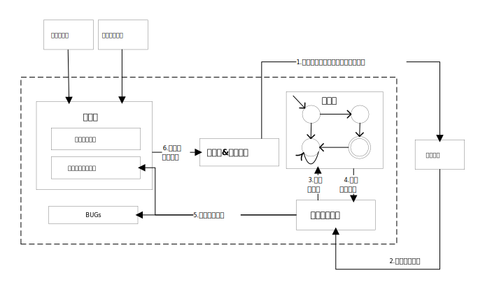

# Blesser: A Stateful Fuzzer Tool

Blesser is a stateful fuzzer tool designed to help developers and security researchers find vulnerabilities in software applications. It is based on a state machine model that allows for intelligent fuzzing of input data, making it an effective and efficient tool for finding bugs.

## Project Overview




## Installation and Usage

### Requirements

### Software Requirements

- Python 3.x
- nRF Connect for Desktop v4.0.1
- nRF Command Line Tools v1.2.4
- **nRF Connect SDK v2.3.0**

##### Hardware Requirements
- nRF52840 DK
- nRF52840 Dongle(for testing)

### Installation

To prepare Blesser, follow these steps:

1. Clone the Blesser repository from GitHub:

```bash
git clone https://github.com/Just1ceP4rtn3r/blesser.git
```

2. Navigate to the `blesser` directory:

```bash
cd blesser
```

3. lnstall the nRF Connect SDK,including the following steps:
- Install [nRF Command Line Tools](https://www.nordicsemi.com/Products/Development-tools/nRF-Command-Line-Tools/Download)
- Install [nRF Connect for Desktop](https://www.nordicsemi.com/Products/Development-tools/nRF-Connect-for-Desktop/Download)
- Install nRF Connect SDK through the TooIchain Manager in nRF Connect for Desktop
- Install Visual Studio Code
- Install nRF Connect Extension Pack(Download from inside VS Code or using Toolchain Manager in nRF Connect for Desktop)
See details at [nRF Connect SDK/Get started](https://www.nordicsemi.com/Products/Development-software/nRF-Connect-SDK/GetStarted#infotabs)


4. Use the nRF Connect for VS Code plug-in to create an application. Move all the files in the blesser/BlessBackend/Backend folder to the newly created application folder, overwriting the original files.

```shell
mv -f blesser/BlessBackend/Backend/* {your_application_folder}/
```

  Move the files in the blesser/BlessBackend/SDK to the zephyr directory of the dependent nRF Connect SDK and overwrite the original files.

```shell
mv -f blesser/BlessBackend/SDK/* {your_nRF_Connect_SDK_folder}/zephyr/
```


5. Connect the nRF52840 DK and flash the modified application to the development board.
    At this point, the lower-level customized message communication module starts to run.

### Usage

We also need to run upper-layer fuzzing module of Blesser.To use the module, follow these steps:

1. Navigate to the `src` directory:

```bash
cd src
```

2. Install the required Python packages:

```bash
pip install -r requirements.txt
```

3.  Run the `core.py` script:

```bash
python core.py 
```

- Upper-layer fuzzing module will start running and will automatically generate input data based on the current state of the state machine.
- To stop the module, press `CTRL+C`.


## TODO


### Challenges

- [ ] EQ如果找到了反例，是否需要优化（例如证明反例的新状态是否与假设模型中的某个状态一致）
- [ ] 有没有意义做Peripheral对Central进行Fuzzing测试
- [ ] Out Of Bound (OOB)这种连接如何自动化
- [ ] 优化方式：如果前面的状态中协商了等级A的能力，后续变异增加使用其他等级能力的概率
- [ ] random的值，是否需要进行重放的变异


