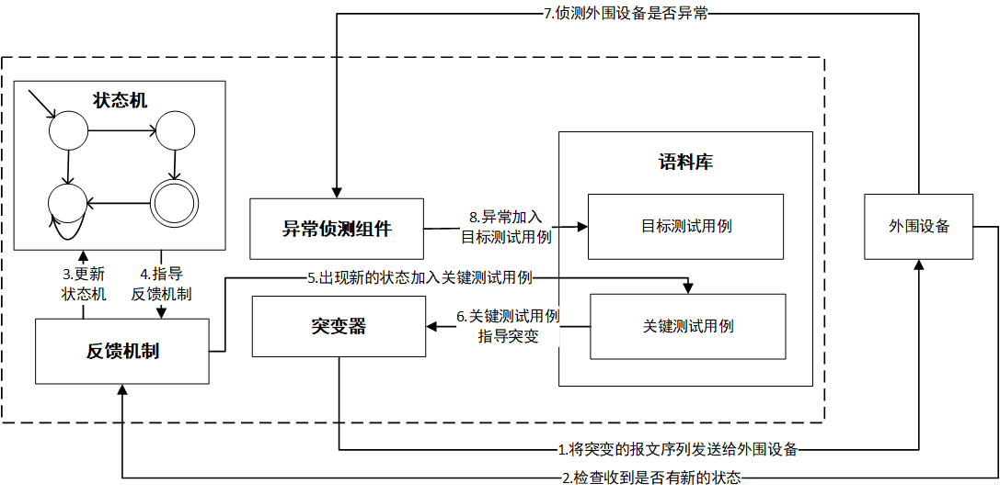

# Blesser: A Stateful Fuzzer Tool

Blesser is a stateful fuzzer tool designed to help developers and security researchers find vulnerabilities in software applications. It is based on a state machine model that allows for intelligent fuzzing of input data, making it an effective and efficient tool for finding bugs.

## Project Overview


Blesser is a tool designed for software developers and security researchers who need a reliable and efficient fuzzer to help them find vulnerabilities in their software applications. It is based on a stateful model that allows for more targeted and intelligent fuzzing of input data. Blesser is open source and available for free on GitHub.



## Project Structure

Blesser is built using Python and is structured as follows:

```
luaCopy codeblesser/
|-- blesser.py
|-- fsm.py
|-- generator.py
|-- mutator.py
|-- utils.py
|-- README.md
|-- LICENSE
|-- requirements.txt
```

-   `blesser.py`: Main file for running Blesser.
-   `fsm.py`: Implements the state machine model used by Blesser.
-   `generator.py`: Generates input data based on the current state of the state machine.
-   `mutator.py`: Mutates input data to increase the coverage of the state machine.
-   `utils.py`: Contains utility functions used by Blesser.
-   `README.md`: Documentation for Blesser.
-   `LICENSE`: License file for Blesser.
-   `requirements.txt`: List of required Python packages.

## Installation and Usage

### Requirements

-   Python 3.x

### Installation

To install Blesser, follow these steps:

1.  Clone the Blesser repository from GitHub:

```
bashCopy code
git clone https://github.com/yourusername/blesser.git
```

1.  Navigate to the `blesser` directory:

```
bashCopy code
cd blesser
```

1.  Install the required Python packages:

```
Copy code
pip install -r requirements.txt
```

### Usage

To use Blesser, follow these steps:

1.  Run the `blesser.py` script:

```
phpCopy code
python blesser.py <options>
```

1.  Blesser will start running and will automatically generate input data based on the current state of the state machine.
2.  To stop Blesser, press `CTRL+C`.

## Contributing

We welcome contributions to Blesser! If you'd like to contribute to the project, please follow these guidelines:

-   Fork the Blesser repository on GitHub.
-   Create a new branch for your changes.
-   Make your changes and commit them to your branch.
-   Push your changes to your fork of the Blesser repository.
-   Submit a pull request to the Blesser repository.


## TODO


### Challenges

- [ ] EQ如果找到了反例，是否需要优化（例如证明反例的新状态是否与假设模型中的某个状态一致）
- [ ] 有没有意义做Peripheral对Central进行Fuzzing测试
- [ ] Out Of Bound (OOB)这种连接如何自动化


## License

Blesser is licensed under the MIT License. See `LICENSE` for more information.


